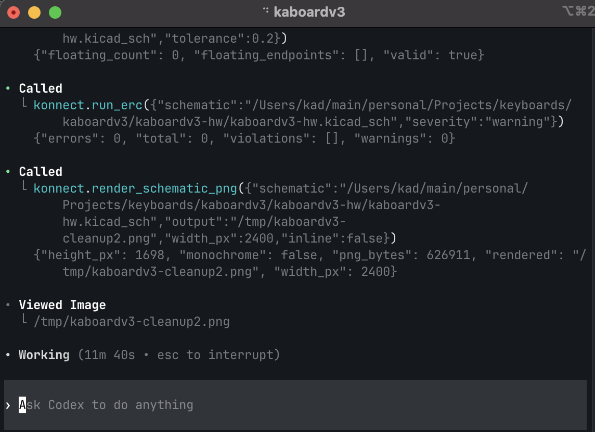
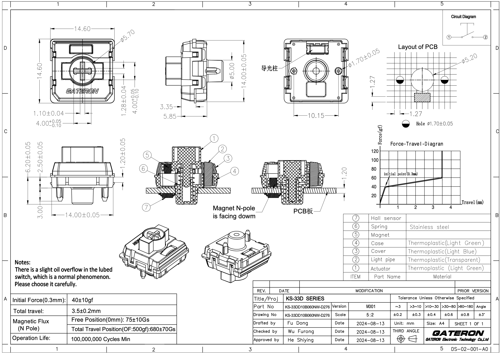

picture of codex using the konnect MCP to generate schematics

Using konnect is super cool. I spent a lot of time brainstorming hardware selection and adressing high level integration probelms

I let AI drive the schematic design, taking care of passives and component specific decisions while I took care of the system level integration. 

This is super helpful. 

image of keyswitch
